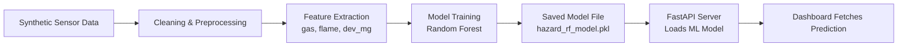
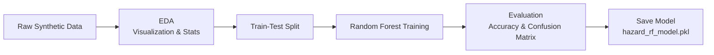

# 🚨 **AI-Powered Multi-Hazard Disaster Prediction System**

### *End-to-End IoT + Machine Learning + Full-Stack Real-Time Dashboard*

This project upgrades a traditional STM32-based multi-sensor disaster detection node into a **complete AI-powered hazard prediction platform**.

It integrates:

* 📡 **Simulated IoT Sensor Data** (gas, flame, vibration)
* 🤖 **Machine Learning Model (Random Forest)**
* ⚙️ **FastAPI Backend**
* 🌐 **React Real-Time Dashboard**
* 📊 **Live Charts, Alerts, and Simulation Controls**

---

# 📘 **1. Project Overview**

This system predicts the following hazards:

* 🟢 **SAFE**
* 🔥 **FIRE**
* ☢️ **GAS LEAK**
* 🌎 **EARTHQUAKE**
* 💥 **MULTI HAZARD** (combined events)

Sensor values are modeled using the real characteristics of:

* **MQ-2 Gas Sensor**
* **Flame Sensor (IR)**
* **MPU6050 Accelerometer**

Originally implemented on the **STM32F401 Black Pill**, the project is extended into a modern AI-powered hazard intelligence platform.

---

# 📁 **2. Folder Structure**

```
ai-disaster-management/
│
├── embedded_node/         # STM32 firmware (C)
├── data/                  # Synthetic data generator + CSV
├── ml_model/              # Training notebook + ML model (.pkl)
├── backend/               # FastAPI hazard prediction API
└── dashboard/             # React real-time monitoring UI
```

---

# 🤖 **3. Machine Learning Model**

* **Algorithm:** Random Forest
* **Accuracy:** 98–99%
* **Trained on:** Synthetic sensor data generated from real STM32 sensor behavior
* **Features Used:**

  * Gas ADC value
  * Flame (0/1)
  * Vibration magnitude (mg deviation)
* **Output:** Hazard class + confidence score
* **Model File:** `hazard_rf_model.pkl`

---

# ⚙️ **4. Running the Backend (FastAPI)**

```bash
cd backend
uvicorn app:app --reload
```

API docs (Swagger UI):
👉 [http://127.0.0.1:8000/docs](http://127.0.0.1:8000/docs)

Example request:

```
/predict?gas=1700&flame=1&dev_mg=40
```

---

# 🌐 **5. Running the React Dashboard**

```bash
cd dashboard
npm install
npm start
```

### Dashboard Features

* 🔮 Live hazard prediction
* 🧪 Simulation buttons (Fire, Gas, Earthquake, Multi-Hazard)
* 📈 Gas + vibration trend charts
* 🕒 Alert history
* 🟥🟧🟨🟩 Color-coded hazard cards

---

# 🏗️ **6. Architecture Diagram**

## **🧩 System Architecture**

```mermaid
flowchart LR
    A[STM32 Multi-Sensor Node\n(Gas, Flame, Vibration)] --> B[Synthetic Data\nGenerator]
    B --> C[ML Training Pipeline\n(Random Forest Model)]
    C --> D[Trained Model\nhazard_rf_model.pkl]
    D --> E[FastAPI Backend\n/predict Endpoint]
    E --> F[React Dashboard\n(Real-Time UI)]
```

---

## **🔄 Data Flow**



---

## **🏛️ Full Software Architecture**

```mermaid
flowchart TB
    A[Sensors (Gas, Flame, Vibration)] --> B[STM32 Node (C Firmware)]
    B --> C[Synthetic Data CSV]
    C --> D[Jupyter Notebook\nML Training]
    D --> E[Random Forest Model]
    E --> F[FastAPI Backend\nPython]
    F --> G[REST API\n/predict]
    G --> H[React Dashboard]
    H --> I[Charts, Alerts, Simulation]
```

---

## **🧪 ML Pipeline**



---

# 📸 **7. Screenshots**

## 🟢 SAFE State


---

## 🔥 FIRE State


---

## ☢️ GAS LEAK


---

## 🌎 EARTHQUAKE


---

## 💥 MULTI HAZARD


---

# 📚 **8. About This Project**

This project began as a **multi-sensor STM32 disaster detection system**, and evolved into a **full AI-based hazard intelligence platform**, demonstrating skills in:

* 🔧 Embedded Systems
* 🧪 Data Simulation
* 🤖 Machine Learning
* ⚙️ Backend Development (FastAPI)
* 🌐 Frontend Development (React)
* 📈 Real-Time Visualization

---

# 👤 **9. Author**

**Aadhithya Bharathi**
AI & Embedded Systems Developer

---
